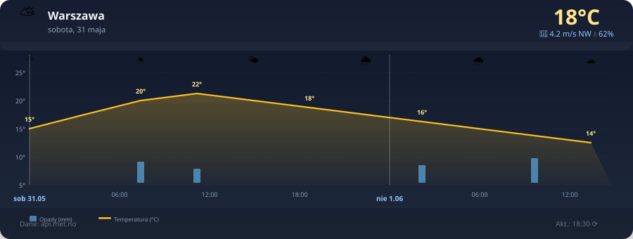

# Yr Weather Graph Card

[](https://github.com/hacs/integration)
[](https://github.com/kamiljaworski88/yr-weather-graph-card/releases)
[](LICENSE)

Karta Lovelace dla Home Assistant wyświetlająca wykres pogodowy na podstawie danych z [api.met.no](https://api.met.no/) (Norwegski Instytut Meteorologiczny). Nie wymaga żadnego klucza API.



## Funkcje

- Wykres temperatury i opadów (SVG, responsywny)
- Ikony symbolizujące stan nieba co 3 godziny
- Aktualna temperatura, wiatr, wilgotność i opady
- Wyszukiwarka lokalizacji przez OpenStreetMap Nominatim (globalnie, bez klucza)
- Visual editor — konfiguracja przez GUI w dashboardzie HA
- Prognoza do 90 godzin
- Automatyczne odświeżanie co 15 min / 30 min / 1 h / 2 h
- Ciemny, nowoczesny motyw graficzny

## Instalacja przez HACS

1. Otwórz HACS w Home Assistant.
2. Kliknij menu ⋮ → **Repozytoria niestandardowe**.
3. Wpisz `https://github.com/kamiljaworski88/yr-weather-graph-card` i wybierz kategorię **Lovelace**.
4. Wyszukaj **Yr Weather Graph Card** i kliknij **Pobierz**.
5. Przeładuj stronę przeglądarki.

## Instalacja ręczna

1. Pobierz `yr-weather-graph-card.js` z [najnowszego wydania](https://github.com/kamiljaworski88/yr-weather-graph-card/releases/latest).
2. Skopiuj plik do `/config/www/yr-weather-graph-card.js`.
3. W Home Assistant przejdź do **Ustawienia → Pulpity nawigacyjne → Zasoby** i dodaj:
   - URL: `/local/yr-weather-graph-card.js`
   - Typ: **JavaScript Module**
4. Przeładuj stronę.

## Konfiguracja YAML

```yaml
type: custom:yr-weather-graph-card
location_name: "Warszawa"
lat: 52.2297
lon: 21.0122
hours: 72
refresh_interval: 1800
```

### Parametry

| Parametr           | Domyślna | Opis                                          |
|--------------------|----------|-----------------------------------------------|
| `location_name`    | Brzeziny | Nazwa miejscowości wyświetlana na karcie      |
| `lat`              | 51.80    | Szerokość geograficzna                        |
| `lon`              | 19.75    | Długość geograficzna                          |
| `hours`            | 72       | Horyzont prognozy w godzinach (maks. 90)      |
| `refresh_interval` | 1800     | Interwał odświeżania w sekundach              |

## Źródła danych

- Dane pogodowe: [api.met.no Locationforecast 2.0](https://api.met.no/weatherapi/locationforecast/2.0/documentation) — wolne od opłat, bez rejestracji
- Geokodowanie: [Nominatim (OpenStreetMap)](https://nominatim.openstreetmap.org/) — bez klucza API

## Licencja

MIT © [kamiljaworski88](https://github.com/kamiljaworski88)
